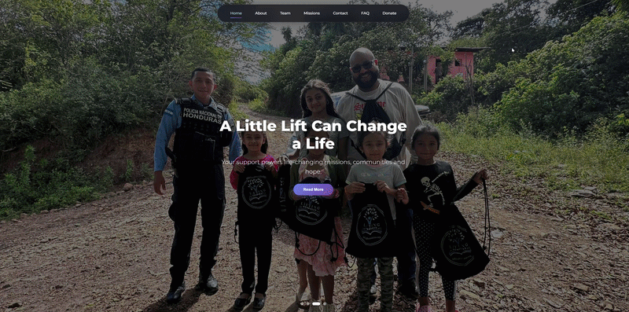

## 🌐 Live Preview

## 📌 Overview
Designed and developed a custom website for **Lifting Honduras Foundation**, a registered 501(c)(3) nonprofit supporting education in underserved communities in Honduras.  

This project was completed over one month and involved frequent client collaboration, multiple design iterations, and a focus on creating a trustworthy, engaging user experience that clearly communicates the organization’s mission and encourages donations.

## 🛠 Tech Stack
- **Frontend:** React, HTML, CSS  
- **Deployment:** GitHub Pages  

## 🚀 Contributions & Outcome
- Led the project end-to-end, from concept to deployment  
- Collaborated directly with the client to refine design and functionality  
- Built a responsive, user-focused interface to improve accessibility and engagement  
- Delivered a professional platform that strengthens credibility and supports outreach  